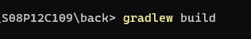

# 포트 포워딩 문서

Status: Done
업무: 결과물

# 개발환경\***\*💻\*\***

### 형상관리

- GitLab

### 이슈 관리

- Jira

### OS

- Window 10

### Communication

- Notion
- Mattermost
- Discord

### UI/UX

- Figma

### Server

- AWS EC2
- AWS S3

### DataBase

- Mysql 8.0.30
- Redis

### IDE

- InteliJ 2022.2.3
- Visual Studio 1.75.1

### Front-End

- Vue3
- Vuex
- TailWind
- PostCs
- Sock.js

### Back-End

- Java Open-JDK
  zulu (11)
- Spring Boot Gradle
  2.7.8 - Spring JPA - Spring Security 5 - Lombok - JWT
- Kafka
- Websocket / STOMP

### CI/CD

- Docker
- Jenkins

---

</br>
</br>

# FrontEnd 빌드 방법🛠

- 환경 변수

```c
.env.local


VUE_APP_API_BASE_URL=http://i8c109.p.ssafy.io:8089/

```

- tailWind 설치
  1. [https://tailwindcss.com/docs/installation](https://tailwindcss.com/docs/installation)
  2. 설치 에러시 : [https://dalya-tech.tistory.com/49](https://dalya-tech.tistory.com/49)
- SockJs 설치
  1. `npm i webstomp-client sockjs-client`
- Node.js version : 14.21.1 (Currently using 64-bit executable)
- /front 폴더 안에서 아래 명령어를 실행한다.

```jsx
npm install
npm uninstall tailwindcss postcss autoprefixer
npm install -D tailwindcss@npm:@tailwindcss/postcss7-compat @tailwindcss/postcss7-compat postcss@^7 autoprefixer@^9
npx tailwindcss init -p
npm run build
```

---

</br>
</br>

# BackEnd 빌드 방법🛠

- **application.yml**

```yaml
# 서버 포트 설정
server:
  port: 포트번호

# jwt 시크릿 키 설정
jwt:
  token:
    secret: 시크릿 키

#Amazon S3
cloud:
  aws:
    region:
      static: S3를 서비스할 region 명 (서울 : ap-northeast-2)
    s3:
      bucket: 버킷이름
    credentials:
      access-key: 발급받은 access-key  //노출 금지
      secret-key: 발급받은 secret-key  //노출 금지
    stack:
      auto: false

#JPA 설정
spring:
  jpa:
    hibernate:
      ddl-auto: update .. 상황에 맞게 사용
    properties:
      hibernate:
        show_sql: true
        format_sql: true
        dialect: org.hibernate.dialect.MySQL5InnoDBDialect
    generate-ddl: true
  mail:
    host: smtp.gmail.com
    port: 587
    username: moona0222@hufs.ac.kr
    password: 5525dnflwlq!
    properties:
      mail:
        smtp:
          auth: true
          starttls:
            enable: true
  servlet:
    multipart:
      max-file-size: 10MB
      max-request-size: 10MB
  datasource:
    # mysql 드라이버
    driver-class-name: com.mysql.cj.jdbc.Driver
    # 연결할 DB 비밀번호
    password: 계정 비밀번호
    url: jdbc:mysql://127.0.0.1:3306/DB이름?useUnicode=true&serverTimezone=Asia/Seoul
    # 연결할 DB 유저 ID
    username: 계정이름
  #카프카
  kafka:
    # Kafka 주소
    bootstrap-servers: 127.0.0.1:9092
  #    consumer:
  #      auto-offset-reset: earliest
  #      bootstrap-servers: localhost:9092
  #      group-id: foo
  #      key-deserializer: org.apache.kafka.common.serialization.StringDeserializer
  #      value-deserializer: org.apache.kafka.common.serialization.JsonDeserializer
  #    producer:
  #      bootstrap-servers: localhost:9092
  #      key-serializer: org.apache.kafka.common.serialization.StringSerializer
  #      value-serializer: org.apache.kafka.common.serialization.JsonSerializer
  redis:
    lettuce:
      pool:
        max-active: 10
        max-idle: 10
        min-idle: 2
    # 레디스 포트
    port: 6379
    #연결 주소
    host: 127.0.0.1
    # 비밀번호, Redis AUTH 설정이 안되어있을 경우 비밀번호 없어도 접근 가능
    password: redis 비밀번호

  devtools:
    livereload:
      enabled: true
    restart:
      enabled: false
  freemarker:
    cache: false
```

- [Command] 로컬에서 실행

  - Java 설치되어 있어야 함

  1. Git clone 이후 /back 폴더 안(gradlew 파일이 있어야 함)에서 cmd 열기
  2. cmd에 **gradlew build** 입력

 

- [GUI] 로컬에서 실행
  - IntelliJ 설치되어 있어야 함
    1. /back 폴더를 Open With IntelliJ로 열기
    2. SetUp JDK, Project 등 azul 11로 바꾼후
    3. [ZzaluApplication.java](http://ZzaluApplication.java) 실행
    4. gradle이 모두 build 되어야 실행 아이콘 클릭 가능
    참고노션 : [https://dramatic-armchair-97f.notion.site/e85a109829c94c9ea5c841ca8e852ac5](https://www.notion.so/e85a109829c94c9ea5c841ca8e852ac5)
    1. EC2에 docker를 이용하여 jenkins를 설치한다.
    2. jenkins를 이용해 build 시 gitlab의 dev branch를 받아와 vue를 빌드한다.
    3. 빌드된 vue 파일을 이용하여 spring boot와 연동한다.

---

# 프론트 / 백엔드 통합

- 로컬에서 실행시킬 경우 프론트 빌드 전 (.env.local 주소 확인 필요, Socket 주소 확인 필요 (ChatInsideView.vue, TitleCompetitionView.vue))
- 백엔드 application.yml 파일 포트 설정 확인 필요
- 프론트 빌드로 생성 된 dist 폴더 안 파일들을 스프링부트 /resources/static에 복사한 후 스프링부트를 실행시킨다.
- static 폴더 안은 다음과 같다.
 

---

# 도커 설치

- 우분투용 도커 설치

```
<https://docs.docker.com/engine/install/ubuntu/>

```

# 젠킨스 설치

- 도커로 Jenkins 설치
- 웹 서버도 띄울 예정이므로 포트는 8081로 설정
- `sudo vim /etc/sysconfig/jenkins` 에서 포트 변경 가능

```
sudo docker run --name jenkins -d -p 8081:8080 -p 50000:50000 jenkins/jenkins:lts

```

- 젠킨스 접속
  `http://[IP]:8081`
- 접속 Password는 Ubuntu에 `sudo docker logs jenkins`를 입력해서 찾을 수 있음
- 추천 plugin 설치
- Plugin Manager를 통해서 Avaliable plugin 설치
  `Gitlab`, `Publish Over SSH`, `Mattermost Notification`, `docker`, `node.js` 설치

# 젠킨스 Publish Over SSH

- 젠킨스 관리 > Configure System
- Publish Over SSH에 .pem 키 붙여넣기
- SSH Servers 설정

```
Name : zzalu_deploy_server_test
Hostname : [EC2 domain]
Username : ubuntu
Remote Directory : /home/ubuntu/jenkins_build

```

- 설정 이후 오른쪽 하단 Test Configuration 클릭
- Error 발생 : `jenkins.plugins.publish_over.BapPublisherException: Failed to connect and initialize SSH connection. Message: [Failed to connect session for config [zzalu_deploy_server_test]. Message [java.net.UnknownHostException: http://###/]]`
- Ubuntu 설정

```
mkdir ~/jenkins_build
sudo vim /etc/ssh/sshd_config

```

- /etc/ssh/sshd_config에 아래 2줄 추가

```
	PubkeyAuthentication yes
	PubkeyAcceptedKeyTypes +ssh-rsa

```

- 이후 서비스 재시작 `sudo service sshd restart`
- 결과로 success 반환

# 젠킨스 Pipeline

- New Item -> Pipeline 생성
- pipeline syntax를 클릭한 후 스크립트 생성
- Snippet Generator > Sample Step > checkout: ~
  - gitlab 연동
- Snippet Generator > Sample Step > sshPublisher: ~
  - jenkins, ec2 ssh 연결

# EC2 Ubuntu java 설치

```
sudo apt-get install openjdk-11-jdk

```

# 젠킨스 NodeJs 설치

1. Global Tool configuration

- DashBaord > Jenkins 관리 > Global Tool configuration
- Add NodeJs 14.20.1
- 정상 반영 X 다른 방법을 설치

1. jenkins에 접속해서 설치

- `sudo docker exec -it -u root jenkins /bin/bash`
- nvm 설치 `curl -o- <https://raw.githubusercontent.com/nvm-sh/nvm/v0.35.3/install.sh> | bash`
- 활성화 `. ~/.nvm/nvm.sh`
- 14버전 설치 `nvm install 14`
- 모든 유저에게 적용 `n=$(which node);n=${n%/bin/node}; chmod -R 755 $n/bin/*; cp -r $n/{bin,lib,share} /usr/local`

# 젠킨스 Java 설치

- `sudo apt-get install openjdk-11-jdk`

# 젠킨스 Pipeline Code

- Vue 프로젝트 반영되는 확인

```

node {
    stage('Build') {

        checkout scmGit(~)
        dir("front") {
           sh "pwd"
           sh "npm install"
           sh "npm run build"
       }
    }
}

```

- error-eacces-permission-denied 에러 발생
  `sudo npm install -g --unsafe-perm=true --allow-root` 명령어 실행
- 최종 Pipeline Code

```jsx

```

# 젠킨스 일반 유저 권한 설정

- sudo 명령어 적용 안되는 문제 설치로 해결

```
apt-get update
apt-get install sudo
apt-get install vim

```

- visudo파일을 열기위한 파일 에디터 vim 설치
- `sudo visudo` 명령어로 설정파일 열기
  `jenkins ALL=(ALL) NOPASSWD: ALL` 추가
-

# EC2 Ubuntu MariaDB, Redis, Kafka, Zookeeper 설치

### MariaDB 설치

1. MariaDB 설치
   - cmd에서 docker run 커맨드 실행
     ```
     docker run --name maria-db -d -p 3306:3306 --restart=always -e MYSQL_ROOT_PASSWORD=password mariadb

     ```
2. DB 및 계정 생성
   - cmd에서 docker exec 커맨드 실행
     ```
     docker exec -it maria-db mysql -u root -p

     ```
   - DB 생성
     ```
     create database IF NOT EXISTS `ssafy_sns`;

     ```

### Redis 설치

```
// redis 이미지 불러오기
docker pull redis

// 불러온 이미지를 통해 redis docker 서버 실행
docker run --name myredis -d -p 6379:6379 redis

// redis 연결 확인
docker run -it --link myredis:redis --rm redis redis-cli -h redis -p 6379

// read_only 변경
config set slave-read-only no
```

### Kafka / Zookeeper

1. Git clone
   1. git clone [https://github.com/wurstmeister/kafka-docker.git](https://github.com/wurstmeister/kafka-docker.git)
2. 클론한 폴더에서 docker-compose.yml 파일 수정

   ```
   version: '2'
   services:
     zookeeper:
       image: wurstmeister/zookeeper
       container_name: zookeeper
       ports:
         - "2181:2181"
       restart: unless-stopped

     kafka:
       build: .
       image: wurstmeister/kafka
       container_name: kafka
       ports:
         - "9092:9092"
       environment:
         DOCKER_API_VERSION: 1.22
         KAFKA_ADVERTISED_HOST_NAME: 127.0.0.1
         KAFKA_ZOOKEEPER_CONNECT: zookeeper:2181
         KAFKA_MESSAGE_MAX_BYTES: 10000000
         KAFKA_AUTO_CREATE_TOPICS_ENABLE: 'true'
         KAFKA_DELETE_TOPIC_ENABLE: 'true'
       volumes:
         - /var/run/docker.sock:/var/run/docker.sock
       restart: unless-stopped

   ```

3. 해당 폴더에서 터미널 실행
   1. docker-compose up -d
   2. 여러개의 콘테이너 동시 설치하는 명령어

# EC2 NVM 설치

- `curl -o- <https://raw.githubusercontent.com/nvm-sh/nvm/v0.36.0/install.sh> | bash`
- `source ~/.bashrc`

---

# 서버 구조 / 시스템 흐

- Server 구조
  1. EC2에는 Docker가 설치되어 있다. 설치되어 있는 항목은 다음과 같다.
     1. Jenkins
     2. Redis
     3. Kafka/Zookeeper
     4. MariaDB
  2. Jenkins는 Git Lab의 main, dev, be 브랜치와 Web Hook 연결이 되어 있으며 Push 또는 Merge가 발생할 경우 해당 브랜치를 빌드하고 빌드 결과를 EC2에 SSHPublisher를 이용하여 전송한다.
  3. 이후 nohup java -jar 명령어를 이용하여 Tomcat을 실행시킨다.

 

- 채팅 메세지 Kafka, Redis 적용 구조
  1. 사용자가 Action 또는 Event를 발생 시켰을 경우 해당 서버의 Kafka Producer가 해당 Topic으로 발행한다.
  2. Kafka Server는 이를 수신하고 Kafka Consumer에 전달한다.
  3. Redis Publisher에 Message를 Consume 할 수 있도록 설정한다.
  4. Redis Publisher는 Redis에 발행하고 (ConvertAndSend) 이후 모든 구독자에게 해당 메세지가 전달된다.
  5. 그림에는 생략되어 있지만 Web Socket과 STOMP가 사용되었다.

 

---

# Amazon S3 (**S**imple **S**torage **S**ervice)

- 아마존 S3 접속 후 로그인

[클라우드 스토리지 | 웹 스토리지| Amazon Web Services](https://aws.amazon.com/ko/s3/?trk=024bf255-8753-410e-9b2f-8015932510e8&sc_channel=ps&s_kwcid=AL!4422!3!588924203916!e!!g!!s3&ef_id=Cj0KCQiAxbefBhDfARIsAL4XLRpLySXEtIy5gsuuGAQT9eKL4XLrjmubWcGMSl7l1Slg6Dtq8AD1xMoaAiePEALw_wcB:G:s&s_kwcid=AL!4422!3!588924203916!e!!g!!s3)

## 버킷 생성

### 1. **버킷 이름에 사용자가 원하는 버킷 이름을 입력한다. (ex : zzalu-bucket)**

 

### 2. **객체 소유권 ACL 활성화를 한다.**

- Spring 을 통하여 Amazon S3에 파일을 업로드 하기 위해서는 ACL을 활성화 해야한다. 비활성화 상태라면 AmazonS3Exception: The bucket does not allow ACL이 발생한다

 

### 3. **버킷의 퍼블릭 엑세스 차단 설정** (상황에 맞게 조절)

 

## AWS IAM 생성

- AWS 환경이 아닌 로컬 환경에서 S3를 사용하기 위해선 별도의 사용자가 필요합니다.
- AWS IAM은 **사용자의 계정 또는 그룹에 따라 독립적으로 AWS 자원에 접근을 제어하고 권한을 제어하는 등의 자격 증명을 관리하는 서비스입니다.**
- **([https://docs.aws.amazon.com/ko_kr/IAM/latest/UserGuide/introduction.html](https://docs.aws.amazon.com/ko_kr/IAM/latest/UserGuide/introduction.html))**

### 1. 대시보드에서 사용자 클릭

 

### 2. 사용자 만들기

- IAM 콘솔에서 사용자를 하나 추가해주도록 합니다.
- 여기서 추가한 사용자는 하나의 접근 계정이라고 생각하면 됩니다.
- **어플리케이션에서 버킷에 접근을 위해 필요한 계정입니다**.

 
 

### 3. 권한 설정

 

### 4. IAM > 보안 자격 증명

- 들어가서 액세스 키를 발급합니다.

 

 

- .csv 파일을 다운로드 후 안에 적혀있는 엑세스 키와 시크릿 키를 이용합니다.

```yaml
#Amazon S3
cloud:
  aws:
    region:
      static: S3를 서비스할 region 명 (서울 : ap-northeast-2)
    s3:
      bucket: 버킷이름
    credentials:
      access-key: 발급받은 access-key  //노출 되면 절대 안됨
      secret-key: 발급받은 secret-key  //노출 되먄 잘데 안됨
    stack:
      auto: false
```
